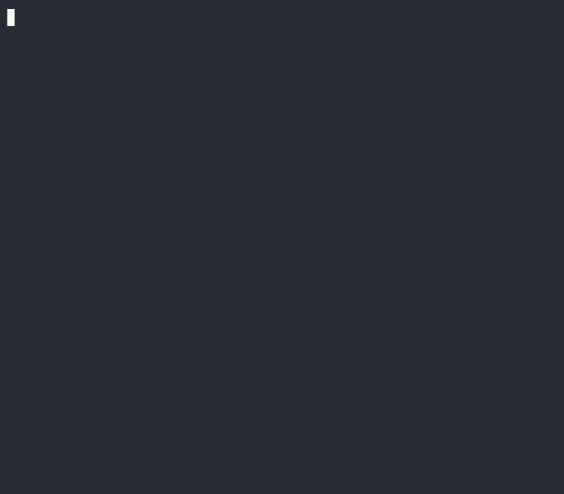
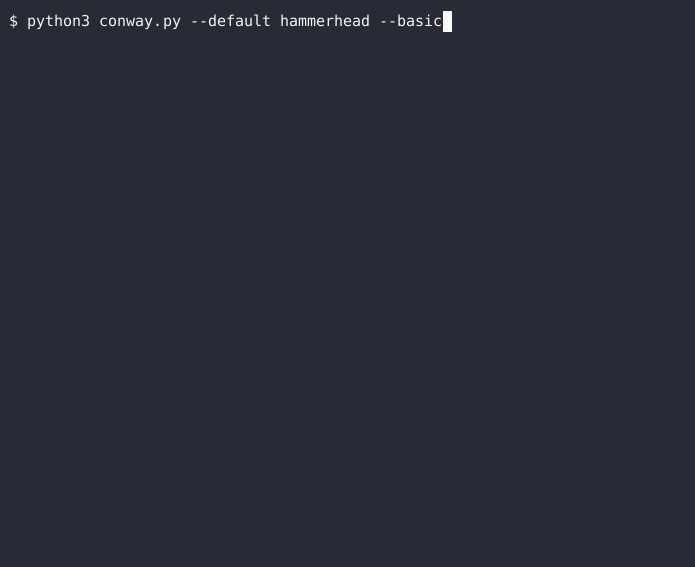
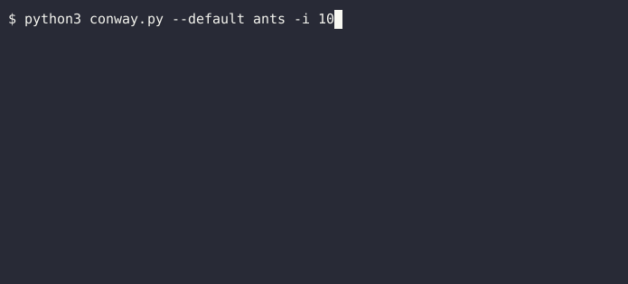
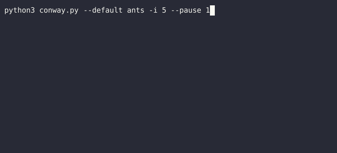
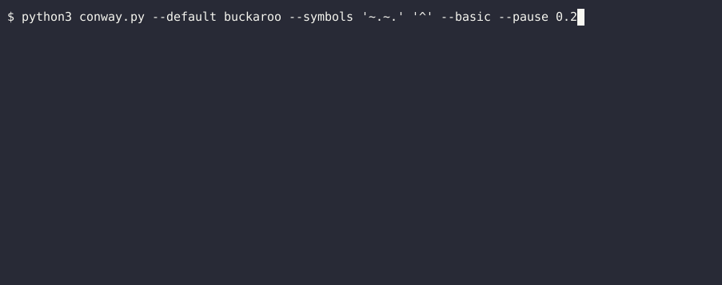
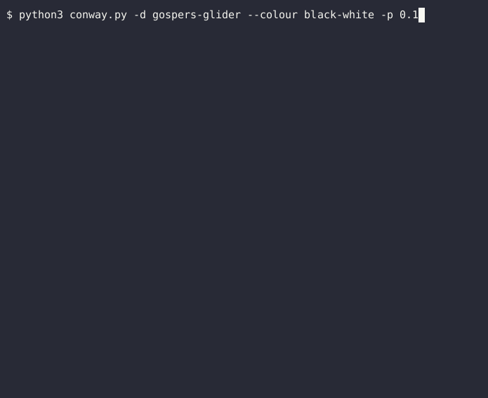
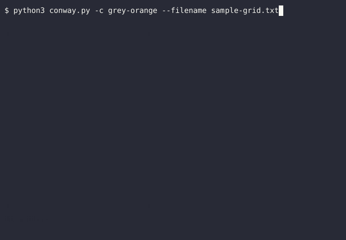

# Conway's game

An implementation of [Conway's game of life](https://en.wikipedia.org/wiki/Conway%27s_Game_of_Life) for the commandline.
\
\
This implementation allows the user to tweak all sorts of properties as they see fit.

---

## How to adjust game properties

---

## Picking cell arrangements from a collection of defaults

```sh
python3 conway.py --default hammerhead
```



---

## Displaying the game in a basic mode, i.e without the pretty display

```sh
python3 conway.py --default hammerhead --basic
```



---

## Deciding how many iterations of the game are run

```sh
python3 conway.py --default ants -i 10
```



---

## Deciding how long a pause there is from one iteration to another

```sh
python3 conway.py --default ants -i 5 --pause 1
```



---

## Providing custom symbols for the cells

```sh
python3 conway.py --default gospers-glider --symbols '~' '^'
```


\
\
\
The fact that custom symbols can be set, along with the fact that the cells can be displayed in a `basic` mode, means
\
that one can produce interesting patterns in the game when they play with unbalanced symbol lengths. e.g.

```sh
python3 conway.py --default buckaroo --symbols '~.~.' '^' --basic --pause 0.2
```



---

## Controlling (via presets), the color scheme that dead and alive cells have

```sh
python3 conway.py -d gospers-glider --colour black-white -p 0.1
```


\
\
\
Here is the same game, but with the dead and alive colours reversed, i.e.

```sh
python3 conway.py -d gospers-glider --colour white-black -p 0.1
```


---

## Providing a custom grid, by way of a text file

---

### Format of cells in the text file

The grid provided is expected to contain only `-` and `*` characters to represent dead and alive
\
cells respectively.
\
\
Providing any other characters (except white-space) in your text file will give you an error that highlights what that invalid character is.
\
\
Yes, this also means that you must have one grid per text file

---

### Acommodation for white-space in the provided text file

Spaces, or tabs within the grid are replaced by dead cells.
\
Accomodating for these does contribute to error handling and the like, but more importantly
\
it allows for the user to construct a grid by only providing the placement of alive cells
\
(rather than being burdened by placing dead cells as well).
\
\
Here are the contents of the file `sample-grid.txt` located in the same directory as the script file.
\
(To see where the spaces are, highlight the contents)

```sh
  
  
  

  
            *   *
             * *
              *
             * *             
              *
             * *
            *   *
  
  
  
  
 
  
```

```sh
python3 conway.py -c grey-orange --filename sample-grid.txt
```

That gives this output:



---

### Providing a file that does not exist

\
If a file/file path does not point to a file, a random selection from the pre-defined
\
grids is shown instead
